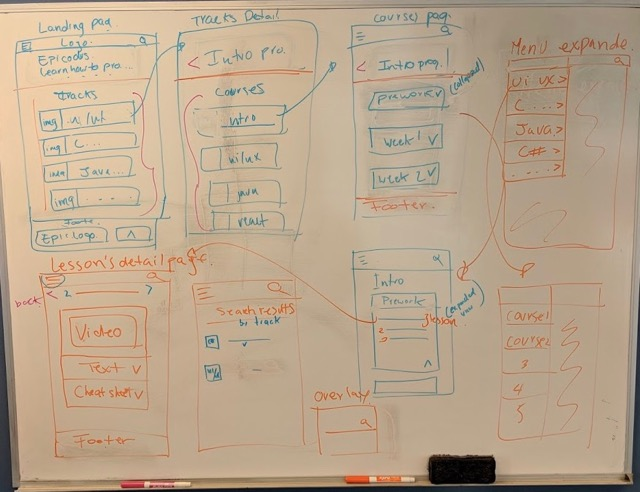

## Project Title
 learnhowtoprogram.com redesign

#### Names of Author(s)
Gary Bermudez
Chris Breaux
#### Date of Completion

### Description

Write about what the project does, what inspired you, what its goals are, what issues you're trying to fix, or what concepts you're completing this project to learn in this section here.

### Images

Screenshots of your Sketch wireframes should go here. Make sure to include all versions (if you have different mobile, tablet, desktop, etc.) designs. Use Dropbox or another free image hosting service to host your images.

#### Desktop Version

#### Mobile Version

### User Stories

* As a student, I want to navigate easily through content so that I can access relevant information easily.
* As a student, I want an aesthetically pleasing experience so that I can enjoy my time on the site.
* As a student, I want to quickly and easily search for lessons so that I can reduce the time navigating through the site.
* As a student, I want to see my progress in the course so that I can manage my study time effectively.
* As a teacher, I want to update the lesson content so that I can add or change course materials. (content management system)

### Technologies and Resources

* Sketch
* HTML
* CSS
* Sass

### Responsiveness

Describe how the site is responsive, and what different 'versions' this project includes (does it have a mobile version? tablet version? )

### Setup Instructions

Describe how someone can clone and launch this project.

### Roadmap

Is there work you plan on continuing doing on this project? Features you'd like to add?

* Consider
* Listing
* Them
* Here

### License

Determine the license under which this application can be used.

Copyright (c) 2018 **_{ List of Contributors }_**
