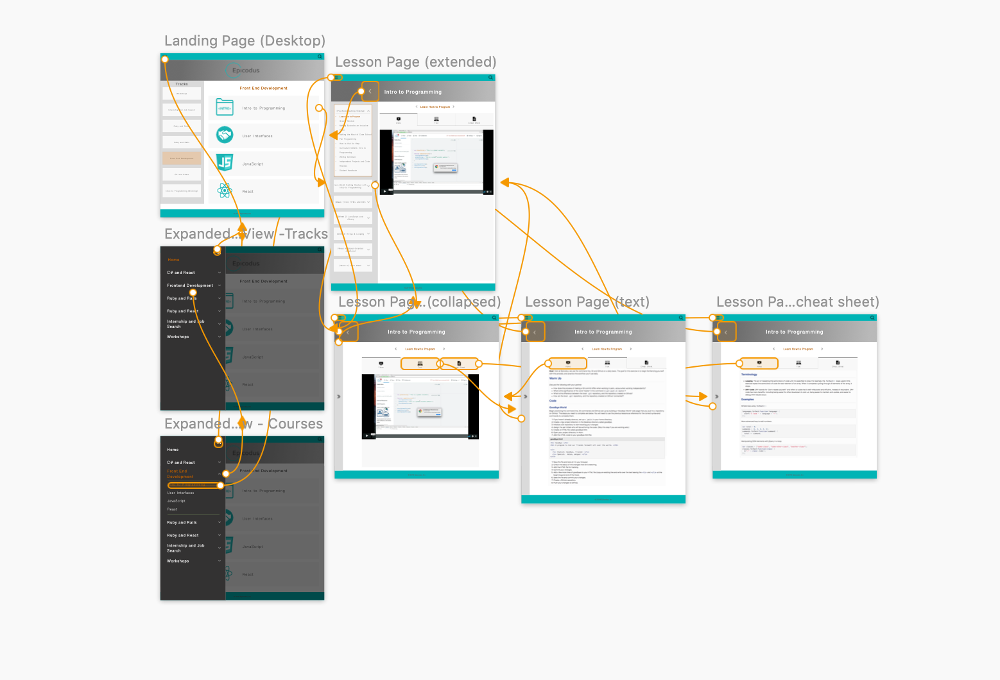
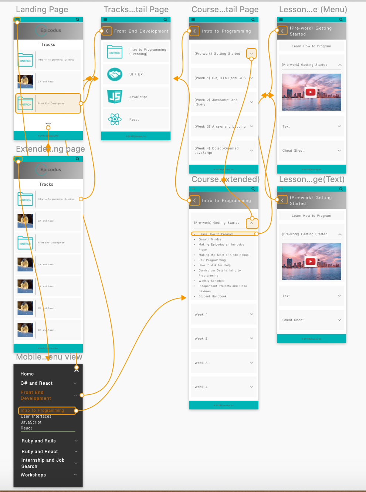
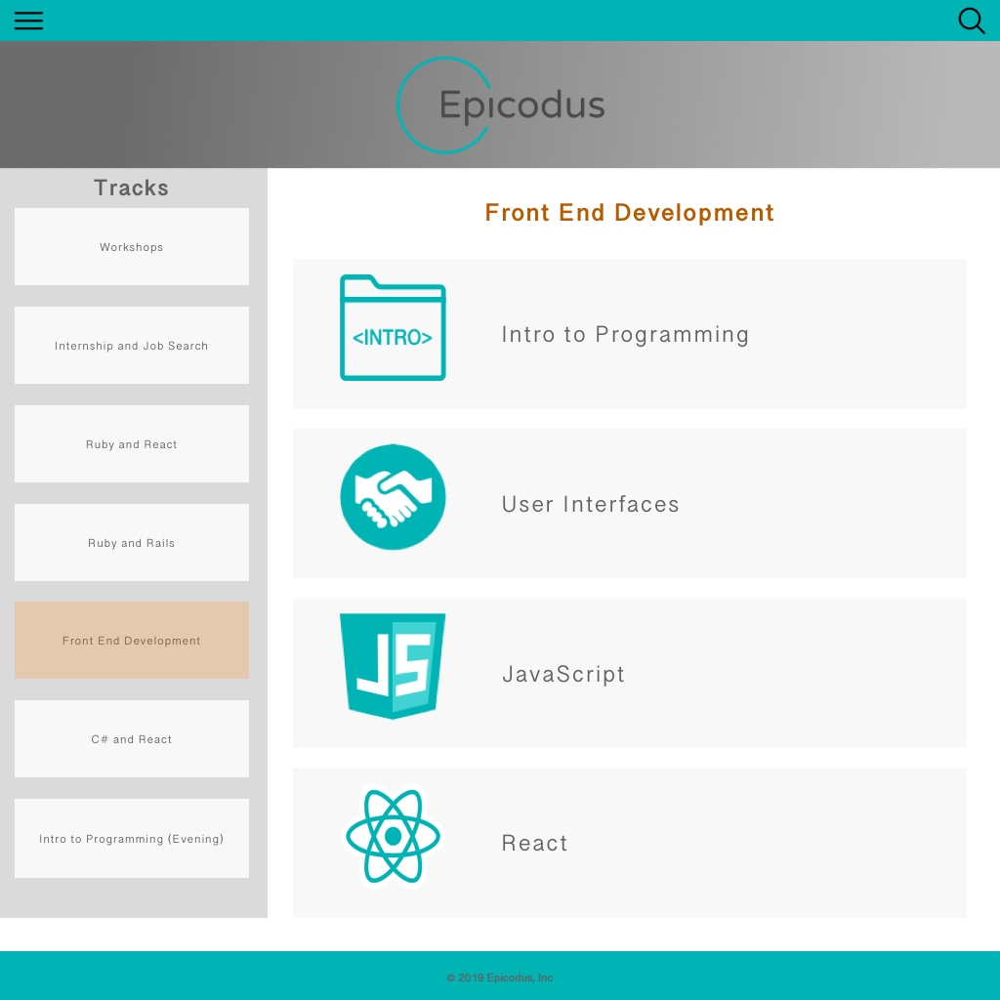
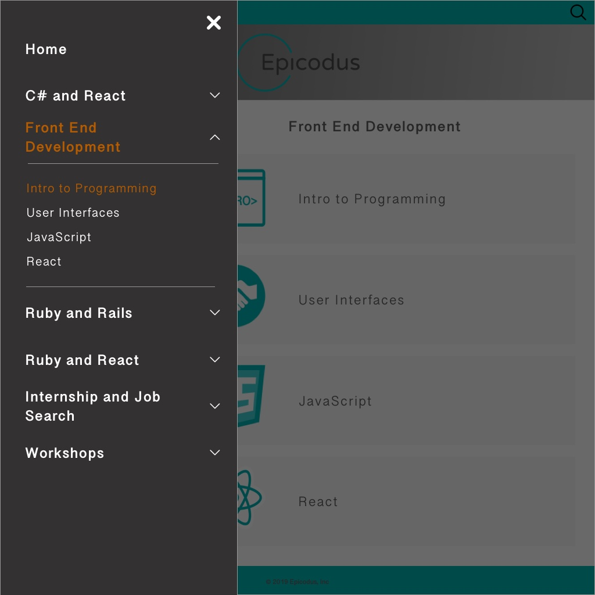

## Project Title
 Epicodus Website Redesign

#### Names of Author(s)
Gary Bermudez

#### Date of Completion

2.21.2019

### Description

This is a redesign of [LearnHowToProgram. ](https://www.learnhowtoprogram.com)

### Images

These are the hand-drawn sketches used for the initial design of the project.

#### Desktop Version

#### Mobile Version

### User Stories

* As a student, I want to navigate easily through content so that I can access relevant information easily.
* As a student, I want an aesthetically pleasing experience so that I can enjoy my time on the site.
* As a student, I want to quickly and easily search for lessons so that I can reduce the time navigating through the site.
* As a student, I want to see my progress in the course so that I can manage my study time effectively.
* As a teacher, I want to update the lesson content so that I can add or change course materials. (content management system)

### Technologies and Resources

* Sketch v50.2

### Responsiveness

This project was designed with a mobile-first approach. With a focus on intuitive navigation, we have included layouts for both desktop and mobile versions. The desktop version includes a side navigation bar while the mobile and tablet views rely upon tiles and drop-downs.

### Setup Instructions

* Clone project from https://github.com/cjbreaux/Epicodus-Redesign.git
* Navigate to 'Epicodus Website Redesign.sketch'
* (Mac Users) Double-click the .sketch file to open in Sketch

### Roadmap

* Ability for students to register on the site in order to track progress.
* Ability for teachers to update lesson content from a CMS.
* Ensure responsiveness across all devices.

### License

MIT License

Copyright (c) 2018 **Gary Bermudez **
